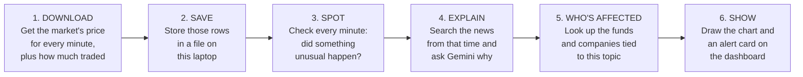
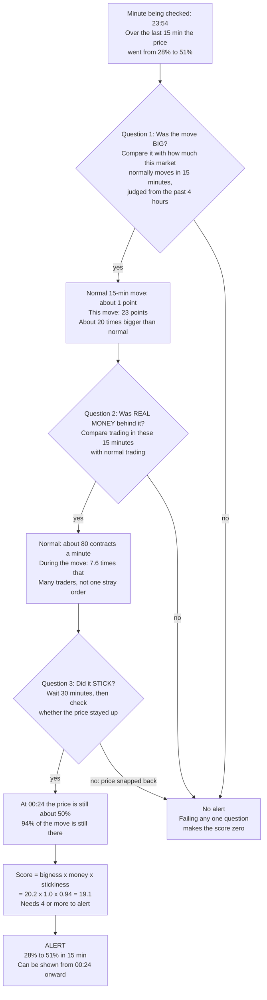
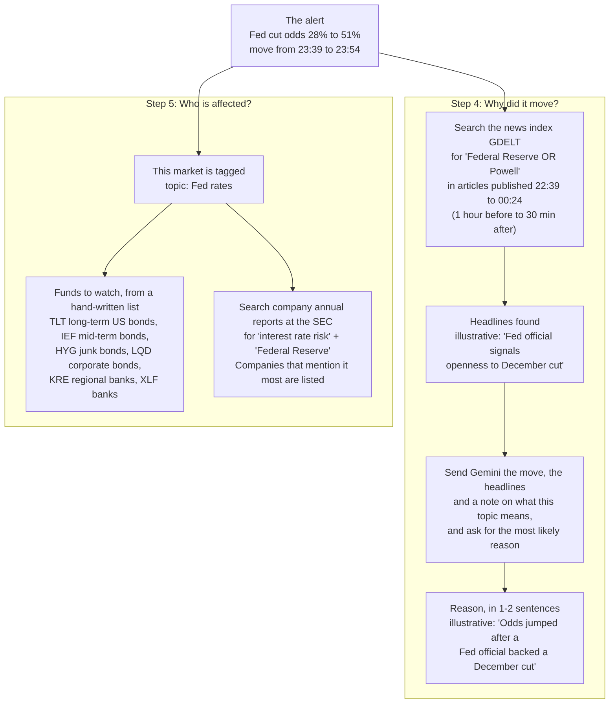
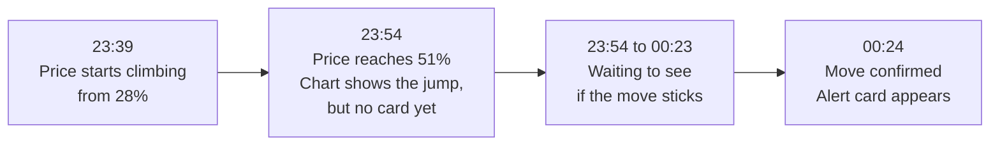

# How one alert is made, start to finish

**The example.** The dashboard always offers a built-in practice market, *"Fed cuts in December
(synthetic demo)"*. It behaves like a real prediction market: a YES share pays $1 if the Fed cuts and
$0 if it doesn't, so its price is the crowd's odds (28¢ means a 28% chance). Late on December 10 its
price goes from **28% to 51% in about 15 minutes**. This page follows that move through the system
until it appears as an alert card on screen.

> **Real or illustrative?** The prices, volumes, scores and times below are real output from running
> the detector on that practice market. Its data is computer-generated with known events planted in
> it, which is why it makes a clean example. The real markets now being watched (listed under steps
> 1–2) go through exactly the same steps. The headlines, the Gemini explanation and the company list
> are made-up examples: in testing so far the news search and the SEC search haven't returned results.

---

## The big picture

| Step | Goes in | Comes out | When it runs | Code |
|---|---|---|---|---|
| 1. Download | Which market, which dates | Price and volume per minute | Only when someone runs a script by hand | `backend/scripts/pull_data.py`, `backend/dislocation_desk/ingest/` |
| 2. Save | Those rows | A file, `backend/data/cache.duckdb` | Same time as step 1 | `ingest/cache.py` |
| 3. Spot | The saved rows for one market | A list of alerts | On the server, when you pick a market or move a detector slider | `detect.py` |
| 4. Explain | One alert's times and prices | A one- or two-sentence reason | On the server, the first time that alert's card is shown | `explain.py` |
| 5. Who's affected | The market's topic, e.g. "Fed rates" | Fund tickers and company names | On the server, once per topic | `expose.py`, `backend/config/exposure.yaml` |
| 6. Show | Everything above | The web page | In the browser, continuously | `frontend/src/` (React), fed by `backend/dislocation_desk/api.py` |

The app has two halves. The **server** (Python, `backend/`) does steps 1–5. The **browser page**
(`frontend/`) asks the server for the price series and the alerts, and runs the replay clock itself.

**Only step 2 saves anything to disk.** The server keeps reasons, company lists and the loaded
prices in memory until it is restarted, so restart it after pulling new data. Alerts are recalculated
whenever you switch market or move a slider.

---

## Steps 1–2: What gets downloaded and saved

The list of markets to watch lives in `backend/config/markets.yaml`. As of 2026-10-09 it holds five
live markets:

| Market | Venue | Has volume? | Topic |
|---|---|---|---|
| Fed cuts 25 bps at the October 2026 meeting | Polymarket | Yes | Fed rates |
| Fed upper bound above 4.00% after the October 2026 meeting | Kalshi | Yes | Fed rates |
| September 2026 CPI rises more than 0.5% | Kalshi | Yes | Inflation |
| Trump raises tariffs on Canada by October 31 | Polymarket | Yes | Tariffs |
| US recession by end of 2026 | Polymarket | Yes | Recession |

The shutdown market is switched off for now, because no plain shutdown market is trading.

For each market we download **one row per minute** and keep exactly these columns. These are the
practice market's rows around its jump:

| Time (UTC) | Price of YES | Contracts traded that minute |
|---|---|---|
| 23:30 | 27.5% | 154 |
| 23:40 | 27.9% | 285 |
| 23:45 | 36.7% | 504 |
| 23:50 | 46.8% | 813 |
| 23:55 | 50.9% | 830 |
| 00:00 | 50.4% | 15 |
| 00:10 | 50.1% | 107 |

A normal minute in this market sees about **80 contracts** traded.

- If no one traded in a minute, the last price is copied forward and the volume is set to 0.
- Kalshi includes volume with its prices. Polymarket's price feed doesn't, so for Polymarket we
  download the list of individual trades separately and add up the shares traded in each minute.

---

## Step 3: How the move is spotted

Every minute, the detector looks back over the **last 15 minutes** and asks three questions. An alert
fires only if **all three** pass.

**Why each question exists:**

| Question | What it filters out |
|---|---|
| Big? | Ordinary day-to-day jitter. "Big" is relative to *this* market: a 3-point move is routine in a jumpy market and huge in a calm one. |
| Real money? | One small trade in a quiet market pushing the price around without many people agreeing. |
| Stuck? | Mistaken or one-off trades that reverse within minutes. These aren't news. |

**Two extra rules:**
- **Blips are ignored up front.** Before the three questions, each price is replaced by the middle
  value of the last 5 minutes. A price that flashes for a minute or two never registers as a move.
  The demo data has one: at 19:00 the price jumps from 33% to 62% for 2 minutes and comes straight
  back, and the detector never sees it.
- **Slow slides get their own check.** A price that creeps the same way for hours never has one big
  15-minute move, so a second check keeps a running total of small moves in one direction. In the
  demo it catches 49% to 36% over almost 3 hours.

---

## Steps 4–5: Explaining the move and finding who is affected

If there's no internet or no Gemini key, step 4 shows the top headline or "Cause unclear", and step 5
shows only the fund list. The page never breaks.

**What actually happens today:** the news search returned no articles in a manual test, and the SEC
search has returned nothing so far. So cards currently show "Cause unclear from news so far" and a
fund-only list. The news search is also one shared text box (default "Federal Reserve OR Powell"), so
a tariff or recession alert searches Fed news unless you change it.

---

## Step 6: When the alert appears on screen

The dashboard **replays** a past day as if it were happening live. The server sends the browser every
alert for the day, each stamped with the earliest time it could have been known. The browser's replay
clock shows each card only once the clock passes that time.

Question 3 needs 30 minutes of waiting, so the card can't honestly appear until 30 minutes after the
move.

The card that appears at 00:24:

> **JUMP · Fed cuts in December (synthetic demo)** — 28% → 51% in 15 min (20.2σ, 7.6× volume)
> **Why:** *reason from step 4*
> **Exposed (Fed policy / rates):** TLT, IEF, HYG, LQD, KRE, XLF · *companies from step 5*
> Move 23:39–23:54, confirmed 00:24 UTC · score 19.1 · held 94%

"20.2σ" means "about 20 times a normal move", and "7.6× volume" means trading was 7.6 times normal.

---

## Nothing here is live yet

- Prices reach the saved file only when someone runs `backend/scripts/pull_data.py` for chosen dates.
  The server then has to be restarted to see them. The app never contacts Polymarket or Kalshi itself,
  so it can't notice a move that's happening right now.
- The only internet calls the app makes are steps 4 and 5, from the server, the first time a card
  (or a topic) is shown.
